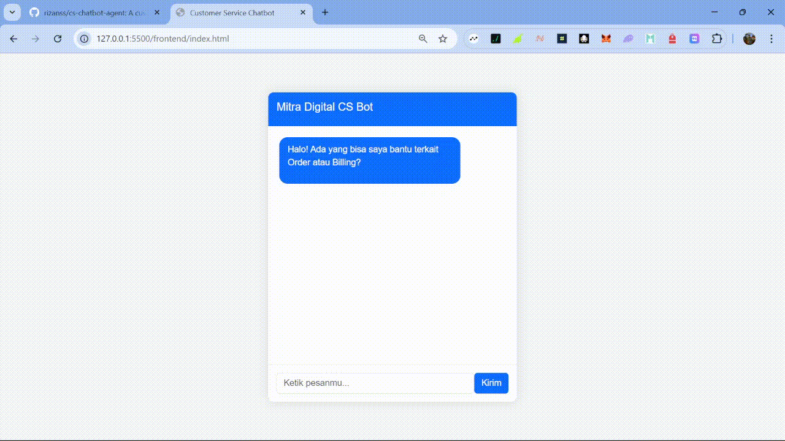

# Customer Service AI Chatbot




## 📝 Deskripsi Singkat

Ini adalah proyek chatbot fungsional, chatbot ini dirancang untuk membantu customer service dengan dua agent spesialis (Order dan Billing) dan memiliki mekanisme eskalasi ke manusia jika AI tidak dapat menangani permintaan.

---

## ✨ Fitur Utama

-   **Router Cerdas:** Menggunakan LLM untuk secara otomatis mengarahkan pertanyaan user ke agent yang paling relevan.
-   **Dua Agent Spesialis:**
    -   **Agent Order:** Dilatih untuk menjawab pertanyaan seputar status pesanan, pengiriman, dan kebijakan pengembalian.
    -   **Agent Billing:** Dilatih untuk menjawab pertanyaan seputar tagihan, faktur, dan metode pembayaran.
-   **Mekanisme Eskalasi:** Jika pertanyaan di luar topik atau terlalu ambigu, chat akan dialihkan ke CS manusia.
-   **Indikator Agent:** UI secara jelas menampilkan agent mana (`Agent Order`, `Agent Billing`, atau `Eskalasi`) yang sedang merespon user.
-   **UI Interaktif:** Antarmuka web yang bersih dan responsif dibangun menggunakan HTML/CSS/JavaScript.

---

## 🛠️ Arsitektur & Teknologi

Proyek ini dibangun menggunakan arsitektur modern dengan pemisahan antara backend dan frontend.

-   **Backend:**
    -   **Framework:** FastAPI
    -   **AI/LLM Logic:** LangChain (menggunakan LCEL - LangChain Expression Language)
    -   **LLM Provider:** Groq API
    -   **Model:** `llama-3.1-8b-instant`
-   **Frontend:**
    -   **Languages:** HTML, CSS, JavaScript
    -   **Styling:** Bootstrap 5

---

## 🚀 Cara Menjalankan Proyek

Berikut adalah langkah-langkah untuk menjalankan proyek ini di lingkungan lokal.

1.  **Clone Repository**
    ```bash
    git clone [https://github.com/cs-chatbot-agent.git](https://github.com/rizanss/cs-chatbot-agent.git)
    cd cs-chatbot-agent
    ```

2.  **Setup Virtual Environment & Install Dependencies**
    ```bash
    # Buat venv
    python -m venv venv

    # Aktifkan venv (Windows)
    venv\Scripts\activate

    # Aktifkan venv (Mac/Linux)
    source venv/bin/activate

    # Install semua library
    pip install -r requirements.txt
    ```

3.  **Konfigurasi API Key**
    -   Buat file baru bernama `.env` di dalam folder `backend/`.
    -   Isi file tersebut dengan Groq API Key Anda:
        ```
        GROQ_API_KEY="gsk_xxxx..."
        ```

4.  **Jalankan Aplikasi**
    -   **Jalankan Backend Server:** Buka terminal, masuk ke folder `backend`, lalu jalankan:
        ```bash
        uvicorn main:app --reload
        ```
    -   **Buka Frontend:** Buka file `frontend/index.html` di browser favorit Anda.
